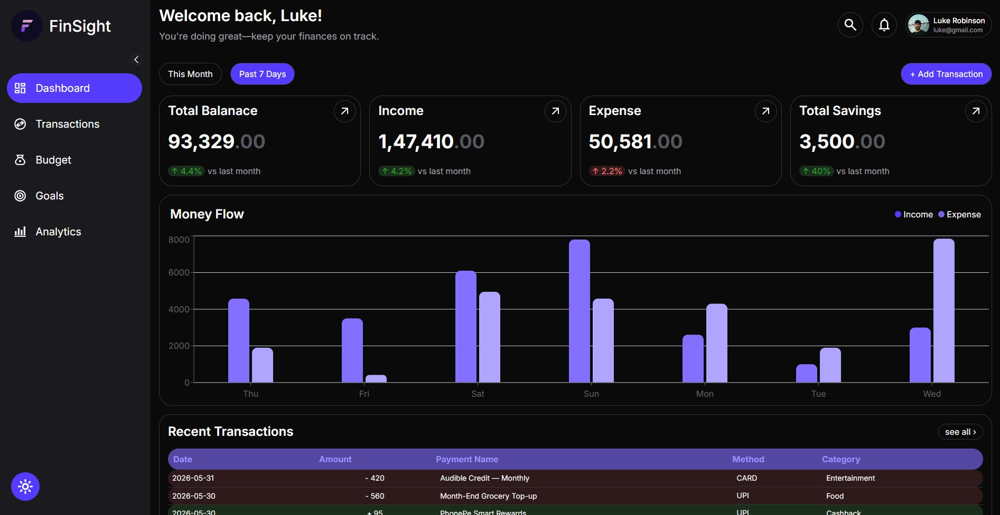
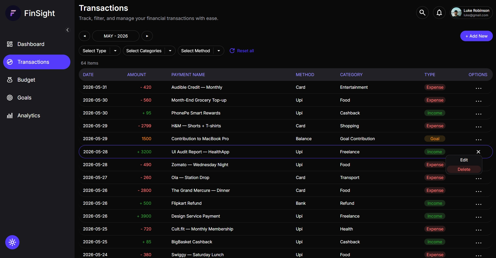
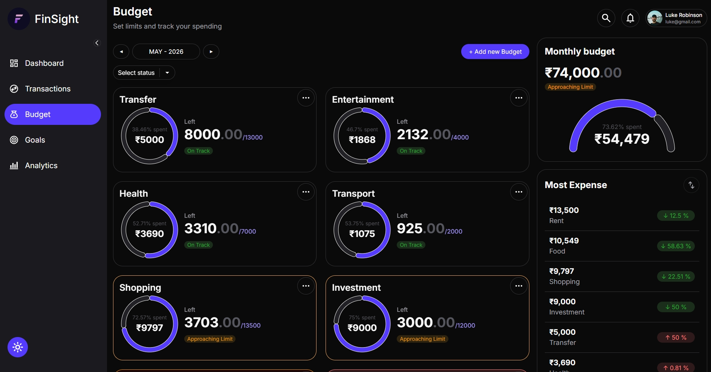
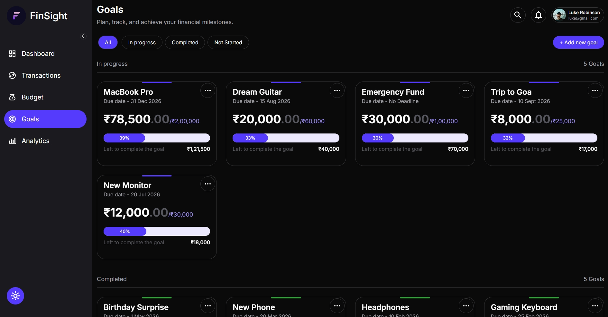
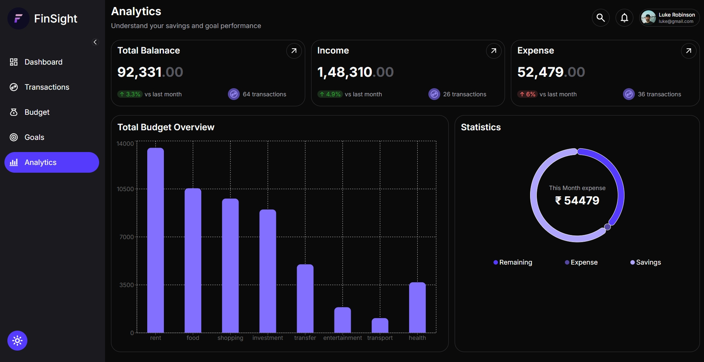

# FinSight 💰

**FinSight** is a modern, feature-rich financial management application designed to help users track, analyze, and optimize their personal finances — all through a clean and intuitive interface.

Built with a strong focus on usability, performance, and visual clarity, FinSight provides a complete front-end experience for managing transactions, budgets, goals, and financial insights.

## 🚀 Features

### 📊 Dashboard

- Overview of **total balance, income, expenses, and savings**
- Interactive **income vs expense graph**
- View **recent transactions**
- Quick filters:
  - Current Month
  - Last 7 Days

- Add transactions directly from the dashboard

---

### 💸 Transactions

- Full transaction management system:
  - ➕ Add new transactions (with validation)
  - ✏️ Edit existing transactions
  - 🗑️ Delete transactions

- Advanced filtering:
  - 📅 Month filter
  - 🔄 Type filter (Income / Expense / Goals)
  - 🏷️ Category filter (dynamic based on type)
  - 💳 Payment method filter (Cash / UPI / Card, etc.)
  - ♻️ Reset all filters

- Detailed transaction list with:
  - Name
  - Amount
  - Category
  - Payment method
  - Actions menu (Edit/Delete)

---

### 📉 Budget Management

- Create and manage category-based budgets

- Monthly budget tracking with:
  - Amount spent
  - Remaining balance
  - Percentage usage

- Budget status indicators:
  - ✅ On Track
  - ⚠️ Approaching Limit
  - 🚫 Over Budget

- Features:
  - Add, edit, delete budgets
  - Filter budgets by status
  - Monthly overview summary
  - Top expense categories visualization

---

### 🎯 Goals Tracking

- Define and manage financial goals

- Goal categories:
  - Not Started
  - In Progress
  - Completed

- Features:
  - ➕ Add new goals (with validation)
  - 💰 Contribute to goals
  - ✏️ Edit goals (title, amount, deadline)
  - 🗑️ Delete goals

- Smart UI:
  - Goals grouped by status
  - Contribution disabled for completed goals

---

### 📈 Analytics

- Financial insights with visual data representation:
  - Summary cards (balance, income, expenses)
  - Month-over-month comparison
  - Budget vs spending chart
  - Key statistics:
    - Total expenses
    - Savings
    - Remaining balance

---

### 🌙 UI & Experience

- Beautiful, responsive design
- **Dark / Light mode toggle**
- Clean and minimal interface
- Smooth user experience with modern UI components

---

## 🛠️ Tech Stack

**Frontend**

- React
- TypeScript
- Vite


**Styling & UI**

- Tailwind CSS
- shadcn/ui


**Routing**

- React Router DOM


**Charts & Visualization**

- Recharts


**State Persistence**

- LocalStorage (no backend)


---

## 📸 Screenshots

### 📊 Dashboard



### 💸 Transactions



### 💰 Budget Overview



### 🎯 Goals Management



### 📊 Analytics Dashboard



---

## ⚙️ Installation & Setup

```bash
# Clone the repository
git clone https://github.com/Yashkamal-dev/finsight-dashboard.git

# Navigate into the project
cd finsight-dashboard

# Install dependencies
npm install

# Run development server
npm run dev
```

> 💡 **Getting Started Tip:** The app will appear empty on first launch — that's expected!
> Start by adding a few **transactions**, then set up your **budgets** and **goals** to unlock the full experience.

---

## 📁 Project Structure

```
src/
├── components/   # Reusable UI components
├── pages/        # Application pages (Dashboard, Transactions, etc.)
├── hooks/        # Custom React hooks
├── context/      # Global state management
├── utils/        # Helper functions
├── types/        # TypeScript definitions
├── assets/       # Static assets
└── layouts/      # Layout components
```

The project follows a modular and scalable architecture, separating concerns into components, pages, hooks, and utilities for better maintainability and readability.

---

## 🔥 Key Highlights

- Real-world financial workflow simulation (transactions, budgets, goals)
- Advanced filtering system across multiple modules
- Fully responsive and modern UI design
- Data visualization using charts for better insights
- Clean and scalable front-end architecture
- Persistent data using LocalStorage

---

## 🚀 Deployment

### 🌐 Live Demo

🔗 https://finsight-dashboard-orpin.vercel.app

Experience FinSight live in your browser — no setup required.


---

## 📈 Future Improvements

- Backend integration (Node.js / Firebase)
- User authentication
- Cloud database (MongoDB / PostgreSQL)
- Export reports (PDF / CSV)
- Notifications & reminders
- Multi-user support

---

## 🤝 Contributing

Contributions are welcome!
Feel free to fork the repo and submit a pull request.

---

## 📄 License

This project is open source and available under the MIT License.


---

## 👨‍💻 Author

**Yashkamal**

Software Developer interested in designing and building efficient systems and modern web applications.
